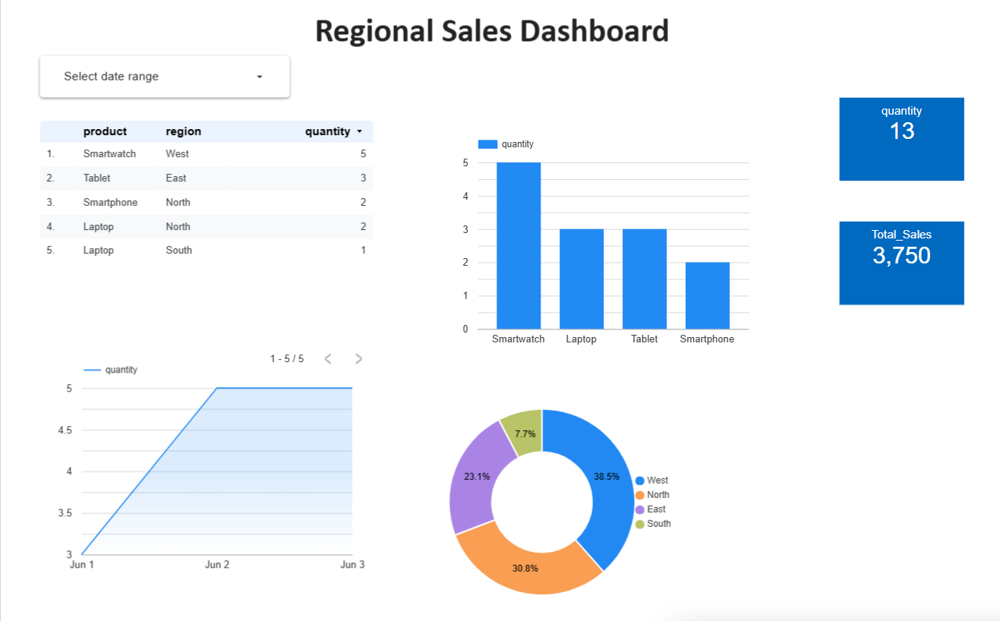

# 🧭 Regional Sales Dashboard

This project visualizes regional product sales using **Google Looker Studio** and supporting tools such as **Excel**, **BigQuery**, **Jupyter Notebook**, and **Python**.


---

## 📊 Dashboard Preview



[🔗 View Interactive Dashboard (Looker Studio)](https://lookerstudio.google.com/reporting/5d27f979-9835-4600-83e7-9c4fa90a9fc4)

---
## 📌 Key Insights

- 🏆 **Top-performing product**: **Smartwatch** — highest quantity sold (**5 units**), indicating strong demand.
- 🌍 **Best region by contribution**: **West** — accounted for **38.5%** of total sales volume.
- 📉 **Lowest contributing region**: **South** — only **7.7%** of total quantity, showing room for regional growth.
- 💰 **Total Sales Revenue**: **₹3,750**, with **13 total units** sold.
- 🔍 **Consistent demand trend**: Steady increase in quantity sold from **June 1 to June 2**, then plateauing — possibly indicates demand saturation or stable performance post-promotion.
- 📊 **Most active region-product combo**: **Smartwatch in West** — 5 units alone came from this combination.

> 💡 These insights suggest focusing future marketing efforts in **West and East regions**, promoting underperforming regions like **South**, and possibly **bundling or upselling Smartwatches** for further growth.

## 📁 Project Structure

| Folder        | Description                                              |
|---------------|----------------------------------------------------------|
| `data/`       | Raw and cleaned sales data (`.csv`)                      |
| `notebooks/`  | Python notebooks used for cleaning or transforming data |
| `docs/`       | Dashboard notes, metrics, and write-ups                  |
| `assets/`     | Screenshots and media for the README and dashboard       |

---

## 🔧 Tech Stack

- **Google Looker Studio**
- **Excel**
- **BigQuery SQL**
- **Python (Jupyter Notebook)**

---

## 📌 Key Metrics Tracked

- Total sales by region
- Product category performance
- Daily sales trends
- Top-performing regions/products
- Monthly revenue comparisons

---

## 🧹 Data Cleaning Highlights

- Removed null values
- Standardized product names
- Parsed sales dates and normalized region names

---

## 🚀 How to Use

1. Clone the repo  
   ```bash
   git clone https://github.com/Tanzayy/regional-sales-dashboard.git
## 📓 Supporting Analysis

All data wrangling and exploratory analysis was done in Jupyter Notebook.  
You can view the notebook [here](notebooks/data-cleaning.ipynb).

  
